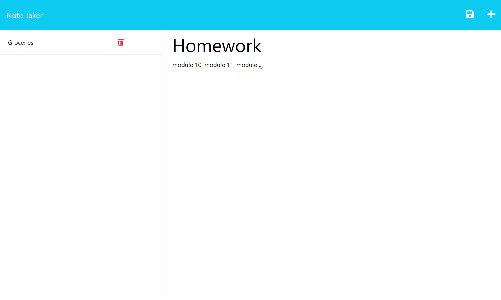

# Note-Taker

  
## Description

The Note-Taker application can be used to write and save notes.

## Table of Contents

- [Installation](#installation)
- [Usage](#usage)
- [Contributing](#contributing)
- [License](#license)
- [Tests](#tests)
- [Questions](#questions)

## Installation

Simply navigate to https://note-taker-taa.herokuapp.com/ to use this application.

## Usage

Click the "+" icon to add a new note. You can enter a note title, as well as some text. Notes can be saved by clicking the save icon, next to the "+". Saved notes are located on the left of the screen, these can be examined by clicking on them or deleted by clicking on the "bin" icon.
    
## Contributing

There are no contribution guidelines at this time.

## License 
    
Copyright 2023

Permission is hereby granted, free of charge, to any person obtaining a copy of this software and associated documentation files (the "Software"), to deal in the Software without restriction, including without limitation the rights to use, copy, modify, merge, publish, distribute, sublicense, and/or sell copies of the Software, and to permit persons to whom the Software is furnished to do so, subject to the following conditions:

The above copyright notice and this permission notice shall be included in all copies or substantial portions of the Software.

THE SOFTWARE IS PROVIDED "AS IS", WITHOUT WARRANTY OF ANY KIND, EXPRESS OR IMPLIED, INCLUDING BUT NOT LIMITED TO THE WARRANTIES OF MERCHANTABILITY, FITNESS FOR A PARTICULAR PURPOSE AND NONINFRINGEMENT. IN NO EVENT SHALL THE AUTHORS OR COPYRIGHT HOLDERS BE LIABLE FOR ANY CLAIM, DAMAGES OR OTHER LIABILITY, WHETHER IN AN ACTION OF CONTRACT, TORT OR OTHERWISE, ARISING FROM, OUT OF OR IN CONNECTION WITH THE SOFTWARE OR THE USE OR OTHER DEALINGS IN THE SOFTWARE.

## Tests

There are no tests at this time.

## Questions

Feel free to visit my Github, [taada33](https://github.com/taada33) or send me an email at taadamson33@gmail.com.

